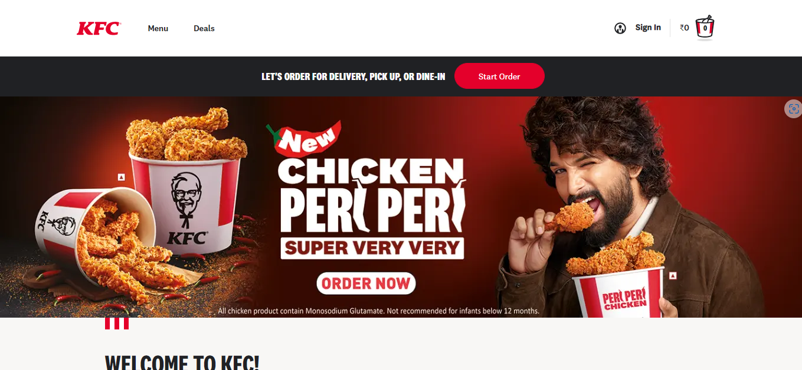
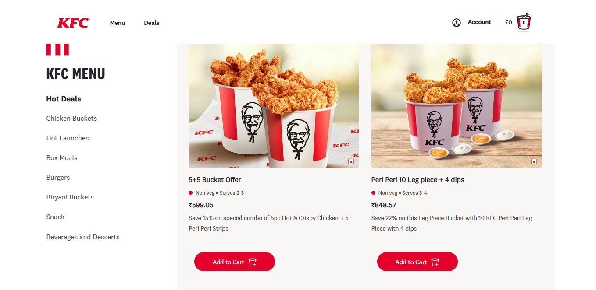
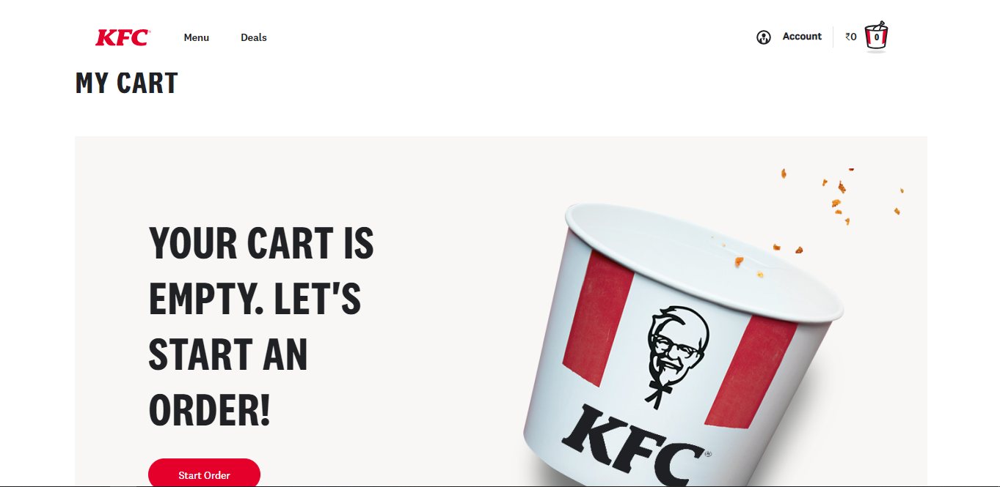
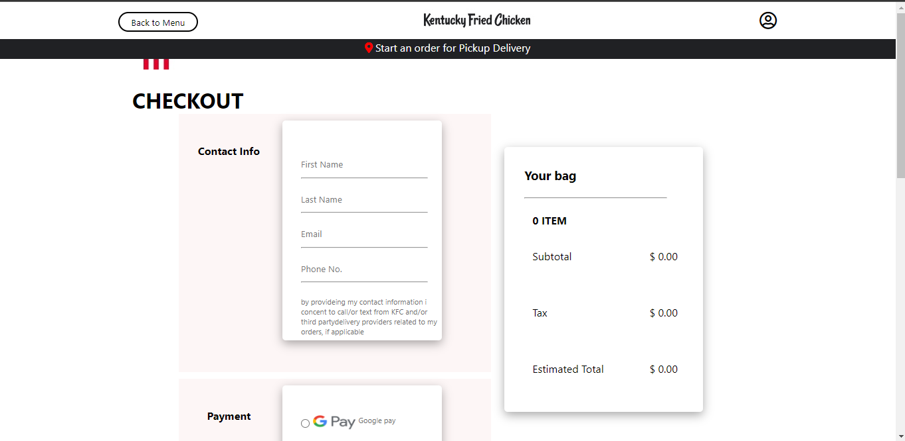

### Hi 👋 we are busy-channel-5933

# Kfc-Clone

 KFC(Kentucky Fried Chicken) is an American fast food restaurant chain headquartered in Louisville, Kentucky, that specializes in fried chicken.
 
I worked on this project during unit-3 construct week at Masai School with the help of other four members.

## Using Languages & Tools 🧰

## Important Links 🔗 
<a href="https://ganesh-onlinekfc.netlify.app/">Deployed Netlify Link</a>
 
<a href="https://github.com/anuragg0107/busy-channel-5933.git">Github Link</a>
 
<a href="https://drive.google.com/file/d/1-MC99ch5urcRBOrxV5c5sK_vja8_h9t5/view?usp=sharing">Project presentation</a>

## 👯 Collaborators
<a href="https://github.com/anuragg0107">Anurag Gupta</a> 
<a href="https://github.com/VijayDevtula">Vijay Devtula</a> 
<a href="https://github.com/Ganeshwebdeveloper">K Ganesh</a> 
<a href="https://github.com/SuyashaRath">Suyasha Rath</a> 
<a href="https://github.com/rupeshgondrawar">Rupesh</a> 

## Screenshots

Home page of the website.

Login and Signup page where user can login or signup in website. 

Menu page with food 🐔 🍔 details.

Cart page with the food Details and total amount of all the cart product.

Checkout page with total amount of all the cart product and transaction id :moneybag: 🍗.

## Features
- Responsive Home Page.
- Login/Signup page with working properly.
- Menu page show appending data.
- Add product in cart page successfully.
- Checkout page otp received and payment done successfully. 

## Area of Responsibility

- Integrated all the pages successfully.
- Developed the Payment page,Cart Page , Login/Signup Page.
- Build Add to cart functionality, product remove button.
